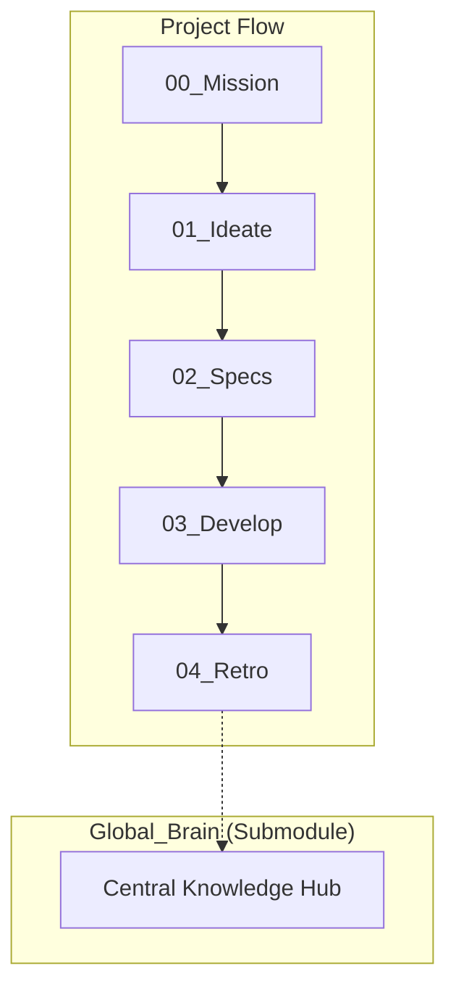

# 💠 Antigravity Agentic OS (AOS) Project Root

这是一个基于 **AOS 2.0 (Industrial Edition)** 协议构建的 AI 原生开发仓库。

## 🏗️ 核心架构图 (Architecture)

## 🚥 执行流水线 (The SSD Protocol)
- **P0 (Mission)**: 确立目标。读取 `Current_Mission.md`。
- **P1 (Ideate)**: 任务拆解。生成 `*_Decomp.md`。
- **P2 (Specs)**: **[关键]** 固化 AC（验收标准）。生成 `*_Spec.md`。
- **P3 (Develop)**: 代码实现。代码位于 `app/`。
- **P4 (Retro)**: 知识提纯。记录于 `04_Engineering_Log`。

## 🛠️ 关键指令 (Instruction Hooks)
- `[INIT]`: 启动/重置使命。
- `[FREEZE]`: 锁定 Specs，进入 P2。
- `[EXEC]`: 开始开发，进入 P3。
- `[ITER]`: 架构回溯，处理边界违约。
- `[DISTILL]`: 知识沉淀到 Global_Brain。

## 🔐 版本信息
- **AOS Core**: v2.2-lockdown
- **Brain Mode**: Distributed (Hub-and-Spoke)
