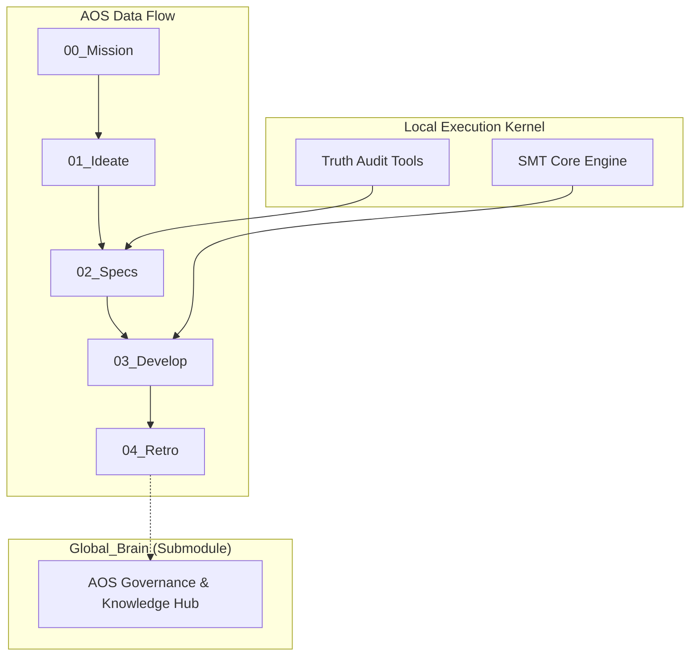

# 💠 Antigravity Agentic OS (AOS) Project Root

这是一个基于 **AOS 2.3 (Industrial Edition)** 协议构建的工业级调度系统开发仓库。

---

## 🏗️ 核心架构图 (Architecture)



## 🚥 AOS 2.3 标准协议 (Standard Operating Procedure)

- **P0 (Mission)**: 确立物理目标。
- **P1 (Ideate)**: 任务拆解与 DSL 生成 (Taylor 展开配置)。
- **P2 (Specs)**: **[物理真理]** 锁定硬件清单 `Hardware_Manifest.json`。
- **P3 (Develop)**: 调度引擎求解。核心位于 `app/`。
- **P4 (Retro)**: 知识提纯，同步至 `global_brain`。

---

## 🚀 快速开始与环境复刻 (Migration & Setup)

### 1. 环境依赖
本项目核心依赖微软的 **Z3 约束求解器**：
```bash
# 建议使用 Python 3.10+
pip install z3-solver
```

### 2. 仓库克隆 (含子模块)
由于 `global_brain` 是独立子仓库，必须使用递归克隆：
```bash
git clone --recursive https://github.com/thecodeforzj/antigravity-test.git
```

### 3. “全链路激活”校验
运行主调度逻辑，看到 `[PASS]` 即代表物理逻辑未受迁移影响：
```bash
python scripts/final_render.py
```

---

## 🛠️ 跨机同步习惯 (Workflow Sync)

在多台设备间交替开发时，务必保护 **AOS 2.3** 完整性：

*   **推送 (PUSH)**:
    1. 在 `global_brain` 修改后先在子目录 push。
    2. 返回根目录，提交并 push 主库。
*   **拉取 (PULL)**:
    ```bash
    git pull
    git submodule update --init --recursive
    ```

---

## 📂 目录职能速查表

| 目录 | 角色 | 迁移重要性 |
| :--- | :--- | :--- |
| **`app/`** | 调度引擎内核 (SMT Core) | **极高** (计算大脑) |
| **`scripts/`** | 编排与真理审计工具 | **极高** (交付认证) |
| **`global_brain/`**| AOS 治理协议子库 | **极高** (合规定义) |
| **`flow/`** | 任务输入与认证工件 | **高** (II 认证数据) |

---

## 🔐 版本信息
- **AOS Core**: v2.3-Industrial
- **Compiler Engine**: SMT-based Modulo Scheduler
- **Brain Mode**: Distributed (Submodule Sync)
