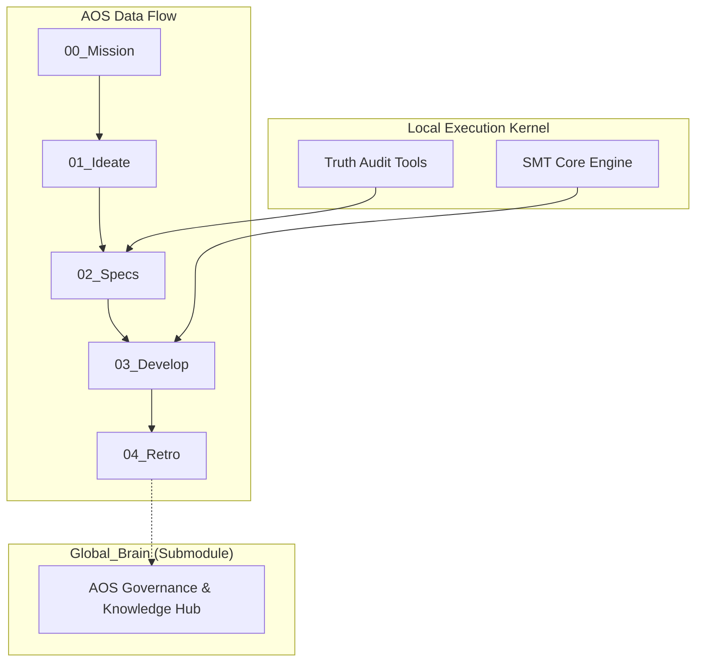

# 💠 Antigravity Agentic OS (AOS) Project Root (V2.6)

这是一个基于 **AOS 2.6 (Truth Guardian Edition)** 协议构建的工业级、具备自我进化能力的调度开发仓库。

---

## 🏗️ 核心架构图 (Architecture)



## 🚥 AOS 2.6 核心治理链条 (The Chain)

本项目执行严格的 **“协议阶位锁”**，任何跳过流程的行为都会触发布防熔断：

1.  **[STATUS] 管线感知**: 识别系统当前的协议阶位（SYNCED -> DEVELOPING -> AUDITED）。
2.  **[CRYSTAL] 意图结晶**: 所有的口头对话必须转化为结晶文档（Skills/Specs）。
3.  **[DOC_SURGERY] 外科手术**: 对核心规格的修改必须执行影子起草与语义 Diff 审计。
4.  **[TRUTH_GUARD] 真理护卫**: 核心规格受 SHA-256 指纹锁定，防止逻辑漂移。
5.  **[PIVOT] 递归治愈**: 任务阻塞时自动执行失败模式分析 (FMEA) 并重新粉碎任务。

---

## 🚀 快速开始与环境复刻 (Migration & Setup)

### 1. 环境依赖
本项目核心依赖微软的 **Z3 约束求解器**：
```bash
# 建议使用 Python 3.10+
pip install z3-solver
```

### 2. 仓库克隆 (含子模块)
由于 `global_brain` 是独立子仓库，必须使用递归克隆：
```bash
git clone --recursive https://github.com/thecodeforzj/antigravity-test.git
```

### 3. “全链路激活”校验
运行主调度逻辑，看到 `[PASS]` 即代表物理逻辑未受迁移影响：
```bash
python scripts/final_render.py
```

---

## 🛠️ 跨机同步习惯 (Workflow Sync)

在多台设备间交替开发时，务必保护 **AOS 2.3** 完整性：

*   **推送 (PUSH)**:
    1. 在 `global_brain` 修改后先在子目录 push。
    2. 返回根目录，提交并 push 主库。
*   **拉取 (PULL)**:
    ```bash
    git pull
    git submodule update --init --recursive
    ```

---

## 📂 目录职能速查表

| 目录 | 角色 | 核心守卫脚本 |
| :--- | :--- | :--- |
| **`app/`** | 调度引擎内核 (SMT Core) | `final_truth_scanner.py` |
| **`scripts/`** | 编排、同步与管线管控 | `aos_pipeline.py` / `aos_push_sync.py` |
| **`global_brain/`**| AOS 治理协议与各阶位 Workflow | `aos_doc_guard.py` |
| **`flow/`** | 任务输入、指纹库与导出工件 | `aos_check.py` |

---

## 🔐 版本与状态信息
- **AOS Core**: v2.6-Truth_Guardian
- **Pipeline Lock**: Enabled (Active State Machine)
- **Causality Audit**: Full Traceability (Sha-256 Bound)
